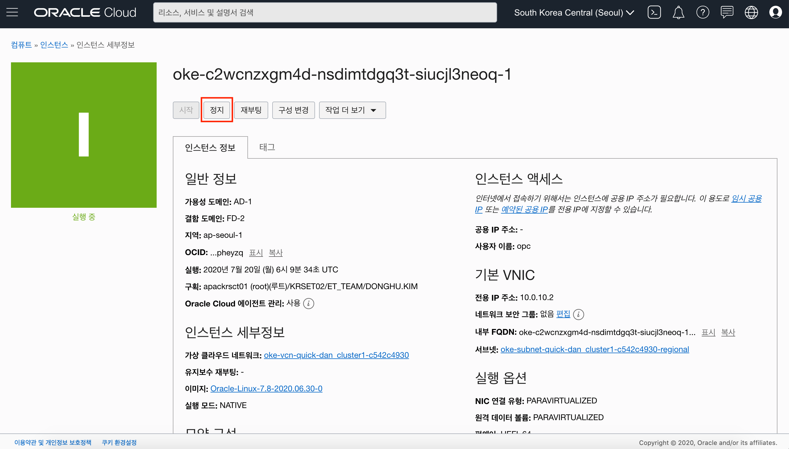

# MySQL Operator on OKE (Oracle Kubernetes Engine)

## Introduction
Oracle Kubernetes Engine (이하 OKE)에 MySQL Operator와 MySQL Cluster를 구성하고, Wordpress를 설치해보는 실습 문서입니다.


## Objectives
* Oracle Cloud Infrastructure 리소스 이해
* Oracle Kubernetes Engine 이해
* MySQL Operator 및 Cluster 구성

## Required Artifacts
* 인터넷 접속 가능한 랩탑
* OCI (Oracle Cloud Infrastructure) 계정
* SSH Terminal (windows Putty, macOS Terminal 등)

## 실습
### ***[PART 1]*** 실습 환경 구성

<details>
<summary>
<i>PART1 따라하기</i>
</summary>

Kubernetes Cluster 생성, ocicli 설치 및 구성, kubectl 설치 및 구성하는 과정입니다. 이 과정은 아래 링크를 참고하여 진행합니다.

> https://mangdan.github.io/creating-oracle-kubernetes-cluster/

</details>

### ***[PART 2]*** MySQL Operator 설치

<details>
<summary>
<i>PART2 따라하기</i>
</summary>

1. MySQL Operator의 경우 Helm (Kubernetes Package Manager)을 사용하여 설치를 진행합니다. 우선 Helm을 설치합니다.

    macOS
    ```
    brew install helm
    ```

    Windows
    > https://helm.sh/docs/intro/install/

2. MySQL Operator Helm Chart 다운로드

    git이 설치되어 있는 경우 다음과 같이 git clone을 이용하여 다운로드 받습니다.

    ```
    git clone https://github.com/MangDan/wordpress-mysql-operator-on-oke.git
    ```

    git이 없는 경우 아래 링크에서 ZIP으로 다운로드 받은 후 압축을 해제합니다. (우측 Code 버튼 클릭 -> Download ZIP 클릭)

    > https://github.com/MangDan/wordpress-mysql-operator-on-oke

3. OKE Cluster에 mysql-operator라는 namespace를 생성합니다.
    ```
    kubectl create ns mysql-operator
    ```

4. Helm Chart를 이용하여 MySQL Operator를 설치합니다.

   ```
   cd wordpress-mysql-operator-on-oke

   helm install mysql-operator mysql-operator
   ```

   (선택) 설치한 mysql-operator를 삭제할 경우 다음과 같이 실행합니다.
   ```
   helm uninstall mysql-operator
   ```

5. 설치된 mysql-operator 확인
    ```
    kubectl get all -n mysql-operator -o wide
    ```
</details>

### ***[PART 3]*** MySQL Cluster 설치

<details>
<summary>
<i>PART3 따라하기</i>
</summary>

1. OKE Cluster에 mysql-cluster라는 namespace를 생성합니다.
    ```
    kubectl create ns mysql-cluster
    ```

2. OKE Cluster에 MySQL에서 사용할 ConfigMap을 생성합니다. 먼저 wordpress-mysql-operator-on-oke 폴더로 이동합니다.
    ```
    cd wordpress-mysql-operator-on-oke
    ```

    ConfigMap 생성
    ```
    kubectl create -f mysql/mysql-config.yaml
    ```

3. OKE Cluster에 MySQL에서 사용할 Secret (패스워드)를 생성합니다. 실습에서 사용하는 root 패스워드는 welcome1 입니다. 
    ```
    kubectl create -f mysql/mysql-password.yaml
    ```

    > 참고) mysql-password.yaml에 기술된 패스워드는 welcome1의 base64 인코딩된 값입니다.

4. mysql-operator에서 mysql-cluster에 대한 인증/인가를 위해서 RBAC(Role-based access control) 생성을 합니다. 
    ```
    kubectl create -f mysql/mysql-agent.yaml 
    ```

5. MySQL Cluster를 생성합니다. 총 3개의 노드를 생성 합니다. (Primayr 1개, Secondary 2개)
    ```
    kubectl create -f mysql/mysql-cluster.yaml
    ```

6. 다른 클러스터 혹은 다른 노드에서 mysql-cluster로 접근하기 위한 NodePort 서비스를 생성합니다.
    ```
    kubectl create -f mysql/mysql-master-svc.yaml
    ```

7. 3개의 노드 (파드)가 정상적으로 설치되었는지 확인합니다.
    ```
    kubectl get all -n mysql-cluster -o wide
    ```

</details>


### ***[PART 4]*** MySQL 접속

<details>
<summary>
<i>PART4 따라하기</i>
</summary>

NodePort가 아닌 LoadBalancer 타입으로 서비스를 생성한 경우에는 Public IP로 접근이 가능하지만, NodePort 혹은 ClusterIP로 구성한 경우 Port forward 혹은 MySQL Client Pod를 생성하여 접속이 가능합니다.

1. MySQL Client Pod를 생성하여 접속
    ```
    kubectl run mysql-client --image=mysql:5.7 -it --rm --restart=Never -- mysql -h mysql-cluster.mysql-cluster -uroot -pwelcome1

    mysql> show databases;
    +-------------------------------+
    | Database                      |
    +-------------------------------+
    | information_schema            |
    | mysql                         |
    | mysql_innodb_cluster_metadata |
    | performance_schema            |
    | sys                           |
    +-------------------------------+
    5 rows in set (0.00 sec)
    ```

2. Service port forward를 생성하여 접속
    ```
    kubectl port-forward service/mysql-cluster -n mysql-cluster 3306:3306
    ```

    새 터미널을 열어서 mysql에 접속
    ```
    mysql -h localhost --protocol tcp -p3306 -uroot -pwelcome1

    mysql> show databases;
    +-------------------------------+
    | Database                      |
    +-------------------------------+
    | information_schema            |
    | mysql                         |
    | mysql_innodb_cluster_metadata |
    | performance_schema            |
    | sys                           |
    +-------------------------------+
    5 rows in set (0.01 sec)
    ```

</details>


### ***[PART 5]*** Wordpress 설치

<details>
<summary>
<i>PART5 따라하기</i>
</summary>

Wordpress는 DockerHub에 있는 **5.4.2-php7.2-apache** 버전을 설치합니다. DockerHub의 Wordpress 정보는 아래 링크를 참고합니다.

> https://hub.docker.com/_/wordpress/

1. OKE Cluster에 Wordpress가 설치될 namespace를 생성합니다.
    ```
    kubectl create ns wordpress
    ```

2. OKE Cluster에 wordpress에서 사용할 mysql root의 password를 가지는 Secret을 생성합니다.
    ```
    kubectl create -f wordpress/wordpress-mysql-password.yaml
    ```

3. Wordpress를 설치/배포 합니다.
    ```
    kubectl create -f wordpress/wordpress-deploy-latest.yaml
    ```

4. Wordpress를 80 포트로 서비스 하기 위해 LoadBalancer를 생성합니다.
    ```
    kubectl create -f wordpress/wordpress-svc.yaml
    ```

5. wordpress namespace에 구성된 모든 오브젝트를 확인합니다.
    ```
    kubectl get all -n wordpress

    NAME                             READY   STATUS    RESTARTS   AGE
    pod/wordpress-677f877f8d-24g7h   1/1     Running   0          113s

    NAME                TYPE           CLUSTER-IP      EXTERNAL-IP      PORT(S)        AGE
    service/wordpress   LoadBalancer   10.96.220.119   132.145.86.192   80:31941/TCP   63s

    NAME                        READY   UP-TO-DATE   AVAILABLE   AGE
    deployment.apps/wordpress   1/1     1            1           113s

    NAME                                   DESIRED   CURRENT   READY   AGE
    replicaset.apps/wordpress-677f877f8d   1         1         1       113s
    ```

6. EXTERNAL-IP로 접속합니다. 언어 설정 화면에서 한국어를 선택합니다.
    

7. 사이트 제목 (Wordpress on OKE), 사용자 명 (admin), 암호, 이메일 주소를 입력하고 **워드프레스 설치하기**를 클릭합니다.
    

8. 로그인 한 후 좌측 상단의 홈 버튼을 클릭하여 워드프레스 홈 화면으로 이동합니다.
    

</details>

### ***[PART 6]*** MySQL Failover 테스트

<details>
<summary>
<i>PART6 따라하기</i>
</summary>

1. 먼저 MySQL Master (Primary) 노드를 확인합니다.
    ```
    kubectl get po -n mysql-cluster -o wide --show-labels
    ```

    

    현재 10.0.10.2 워커 노드에 두 개의 MySQL 노드가 설치되어 있으며, 그 중 하나가 Primary 역할을 하고 있는 것을 확인할 수 있습니다. 여기서 10.0.10.2 노드를 강제로 정지하여 MySQL Master Node가 다른 워커 노드로 이동하는지 확인하도록 합니다.

2. OCI Console로 접속한 후 다음과 같이 클릭합니다.
    > 개발자 서비스 (Developer Service) -> 컨테이너 클러스터 (OKE) -> oke-cluster1 -> 좌측 노드 풀 (Node Pool) -> 우측 하위에 총 워커 노드 (Total Worker Node): 3

    

    MySQL Primary가 있는 워커 노드의 전용 IP (10.0.10.2)에 해당하는 노드를 클릭합니다.
    
3. 워커 노드를 정지합니다.
    

4. 다시 MySQL Master (Primary) 노드를 확인합니다.
    ```
    kubectl get po -n mysql-cluster -o wide --show-labels
    ```
    

    다른 워커 노드 (10.0.10.3)로 Primary 역할이 옮겨간 것을 확인할 수 있습니다.
5. 정상적으로 서비스가 되는 것을 확인할 수 있습니다.
    

</details>